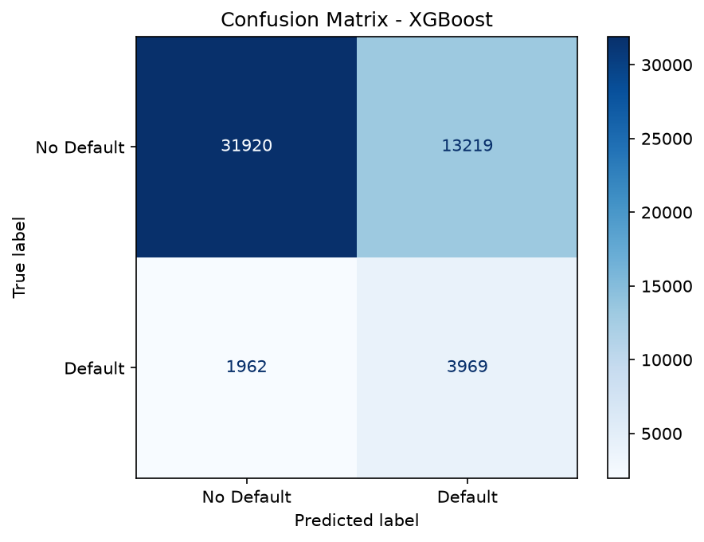
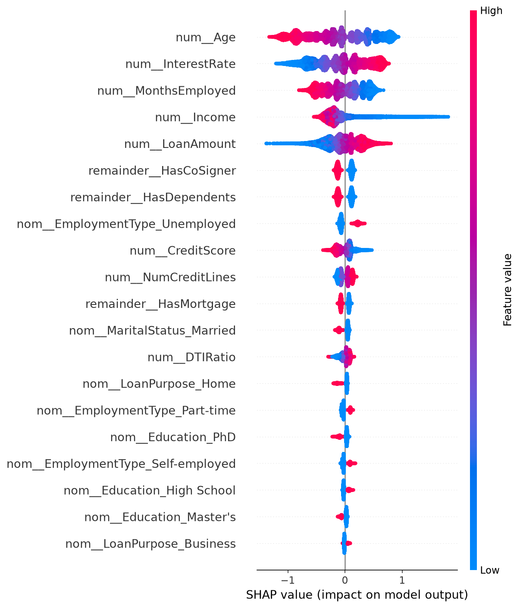

# Loan Default Predictor

Predicts the probability that a loan applicant will default, using the [Kaggle Loan Default dataset](https://www.kaggle.com/datasets/nikhil1e9/loan-default) (255K+ records).

**[Live App](your-streamlit-cloud-url)** • **[EDA Notebook on Kaggle](https://www.kaggle.com/code/shreyavgaonkar/loan-default-dataset-eda)**

## Problem
Lenders need to estimate default risk before approving a loan. This project builds an end-to-end pipeline — from raw data to a deployed prediction dashboard — that outputs a default probability given applicant details.

## Dataset
- 255,347 rows, 18 columns, no missing values
- Target `Default` is imbalanced (~11-12% positive class) — handled via `class_weight`/`scale_pos_weight` throughout

## Approach
1. **EDA** — distribution analysis, correlation heatmap, 5 documented insights (see notebook)
2. **Feature engineering** — train/test split before any transformation (leakage prevention), `StandardScaler` on numerics, one-hot on nominal categoricals, label mapping on binary Yes/No fields
3. **Modeling** — Logistic Regression baseline, then Random Forest and XGBoost, compared via 5-fold stratified cross-validation on F1 and ROC-AUC
4. **Tuning** — GridSearchCV on the best-performing model (best params: `'learning_rate': 0.1, 'max_depth': 3, 'n_estimators': 200, 'subsample': 0.8` — fill in from your `grid_search.best_params_`)
5. **Interpretability** — SHAP TreeExplainer to identify and explain top feature drivers

## Results
| Model | CV F1 | CV ROC-AUC |
|---|---|---|
| Logistic Regression | 0.329683 | 0.746406 |
| Random Forest | 0.214763 | 0.740692 |
| XGBoost (tuned) | 0.339943 | 0.752996 |



## Top features driving predictions (SHAP)


1. **Age** — Younger borrowers show slightly higher risk, aligning with EDA where defaults were more frequent among early-career individuals.
2. **Interest Rate** — Higher rates increase risk, as costly loans are harder to sustain.  
3. **Months Employed** — Shorter tenure correlates with higher risk, reflecting job instability seen in defaults during EDA. 
4. **Income** — Higher income reduces default likelihood, matching the trend that financially stable borrowers manage repayments better.
5. **Loan Amount** — Larger loan sizes push risk upward, as bigger obligations strain repayment capacity. 


## Project structure
```
loan-default-predictor/  
├── data/            # raw + processed data  
├── notebooks/       # EDA, feature engineering, modeling, tuning, SHAP  
├── src/             # reusable preprocessing + inference logic  
├── models/          # trained model + preprocessor artifacts  
├── app/             # Streamlit dashboard  
└── reports/         # figures, CV comparison results  
```

## Run locally
```bash
pip install -r requirements.txt
streamlit run app/app.py
```

## Tech stack
Python, pandas, scikit-learn, XGBoost, SHAP, Streamlit